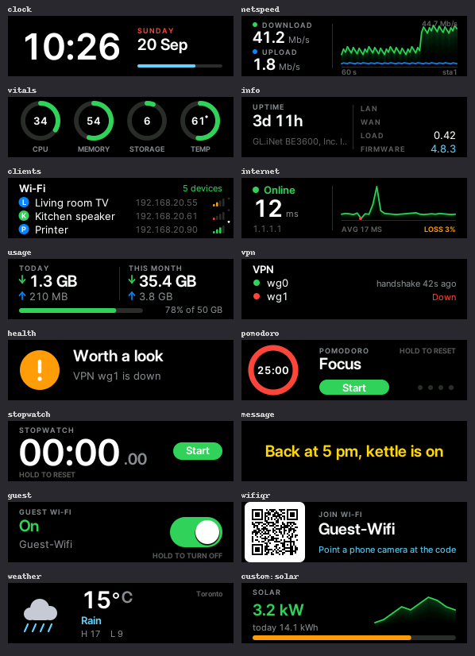

<div align="center">

# GL.iNet Router Screen Saver (BE3600)

**Give your GL.iNet Slate 7's little front screen an animated screen saver.**<br>
Robot eyes, colour fields, your own text, or anything you design.

[](https://github.com/CristoXD73/GL.iNet-Router-Screen-Saver-BE3600/actions/workflows/ci.yml)
-2ea44f)


<sub>The animation that comes with it, shown as the wide strip. It loops for 25 seconds.</sub>

</div>

---

After a few idle seconds, this plays an animation on your BE3600's front
screen. Swipe along it and the picture follows your finger and slides to your next (or
previous) saved animation; a tap does the same; double-tap, or swipe across the strip, to
bring the normal GL.iNet screen back. One download sets it all up, and one command
removes it — nothing about the router's firmware changes.

## Get started (two steps)

Needs: a GL-BE3600 (Slate 7), a computer on the same network as it, and its
admin password.

<div align="center">

### 1. [Download Studio Link](https://cristoxd73.github.io/GL.iNet-Router-Screen-Saver-BE3600/studio/get.html)

</div>

**2. Double-click it** (Windows). **Mac:** open Terminal, type `python3 ` (with the space), drag
the downloaded `studio-link.py` into the window and press Return. Linux: `python3 studio-link.py`.
That one file:

* finds your router,
* asks for its admin password once,
* installs the screen saver if the router does not have it,
* offers to remember this computer, encrypted with a passphrase you choose,
* **opens Motion Studio, already connected** — that is where you design. On a Mac it opens the
  copy Studio Link serves itself, at `http://127.0.0.1:8791/`, because Safari never lets the website
  talk to a helper on your own computer (it works in Chrome, Edge and Firefox too).

The install ends with the eyes waking up on the router's screen while the fan
revs under them, so you know it took. Then **Compile** in Motion Studio sends
your animation over, and the three slots on the page show what is on the router.
It appears after a few idle seconds and survives reboots.

### Step by step

<div align="center">


</div>

<details>
<summary><b>Prefer not to use the website? Install from the ZIP</b></summary>

**Windows:** Click **Code → Download ZIP** above, unzip it, double-click
**`Install.cmd`**, and type your router's admin password when it asks.

**macOS:** double-click **`Install.command`** (the first time, macOS may say it is from an
unidentified developer: right-click it → *Open* → *Open*). Or in Terminal: `./install.sh`.
**Linux:** `./install.sh`


</details>

<details>
<summary><b>Something went wrong, or you want to know what it does</b></summary>

* **Windows says the script is blocked.** Right-click the ZIP → *Properties* →
  tick *Unblock* → OK, then unzip again. Or click *More info, Run anyway*.
* **It can't find the router.** It tries the last address that worked, then
  your gateway, then `192.168.8.1`. Wrong router? It'll ask once and remember
  the answer, or give it directly: `Install.cmd -Router 192.168.x.x`.
* **The password** is your router's normal admin password, typed into `ssh`'s
  own prompt — these scripts never see or store it.
* **What it changes:** a few small files on the router, plus a background
  service. See [below](#turn-it-off-or-remove-it) to undo that.

More help: [`docs/TROUBLESHOOTING.md`](docs/TROUBLESHOOTING.md).
</details>

## Design one, and get it onto the router

<div align="center">

### [Open Motion Studio](https://cristoxd73.github.io/GL.iNet-Router-Screen-Saver-BE3600/studio/)


</div>

Motion Studio is a page in your browser: nothing to install, nothing uploaded.
The **?** button walks through it in four pictures, and the **Motion / Fan**
tabs next to the logo switch between designing an animation and designing a
chime for the fan. Pick **Atmosphere** (six slow colour scenes), **Robot Eyes** (a library of expressions) or **GIF** (bring your own, or press **Search GIFs**: *Classic* shows only GIFs that fit the strip, *Risky* shows any GIF; the compiler crops or fits it to the strip), shape it, then open **Compiler and optimizer** (**Create your
video**) and click **Compile BE3600 Pack**. It asks how long the loop should
be (1-25 s).

With **Studio Link** running (step 2 above), Motion Studio connects to your router
by itself:

* **Compile** sends the animation to the router straight away, named after what
  you made (type your own name in the box if you like).
* The page shows **your router's three animation slots**: each filled slot has its
  name, length and size (the one playing is marked **PLAYING**) with **Play** and
  **Remove**; the rest say *Empty slot*.
* Already have a `.bea` file? **Drop it on the square with the plus** (or click the
  square to choose one). Each file is checked first, so a bad file gets a
  plain-English reason instead of breaking anything.

Windows may warn about the downloaded `.cmd` file (choose *Keep* / *Run anyway*);
it's plain text you can open in Notepad first. If you cloned this repo you can
double-click `Studio-Link.cmd` (macOS: `Studio-Link.command`; Linux: `./studio-link.sh`) instead; same thing.
If Studio Link isn't running, or your browser blocks it, the old way still works:
save the file and drag it onto **`Set-Animation.cmd`** (macOS: double-click `Set-Animation.command`
and drag the file into its window; Linux: `./set-animation.sh`).

**The router keeps up to 3**, so you can switch back later, and **each loops for
at most 25 s**. The same name replaces the old one. Manage them from Motion
Studio, from the router's own screen (put `slots` in `PAGES`: tap moves along the
three, hold removes one), or from a terminal: `be3600-anim list` / `use NAME` /
`remove NAME` (see [all commands](#turn-it-off-or-remove-it)).
<details>
<summary><b>What is Studio Link, and is it safe?</b></summary>

A web page can't log in to your router by itself, so Studio Link is a tiny
helper that does it for the page, using the same check-then-SSH steps as
`Set-Animation`.

* It listens on **this computer only** (`127.0.0.1`); nothing else on your
  network can reach it.
* **Only your own Motion Studio tab can use it.** Each time Studio Link starts it makes a
  fresh secret token and opens Motion Studio with that token in the address; the page keeps
  it and sends it with every request. Other websites, other programs and other users on this
  computer don't have it, so they get nothing. (A page also has to come from Motion Studio's
  own site or `localhost`, and a sandboxed page, `Origin: null`, is always refused. Running a
  fork on another address? Set `STUDIO_LINK_ORIGINS`.)
* It only ever accepts a valid `.bea` animation (checked here and again on the
  router), and only while you have it running.
* **Your router password is typed into the Studio Link window**, never into
  the web page. It is held in that window's memory only, handed to `ssh` for the
  moment each call runs (so nothing else it starts, such as your browser, can
  inherit it), and never written to disk.
* **Remember this computer** (optional, asked once) keeps a private key on this
  computer and adds its public half to the router, so the password is never asked
  again. The key file is **locked with a long random passphrase**, and that passphrase
  is kept where only you can open it: Windows' per-account encryption (DPAPI), the macOS
  Keychain, or the Linux keyring. Copying the key file somewhere else gets nobody in.
  Anyone signed in as you on this computer can still reach the router, so undo it any
  time with `Studio-Link.cmd -Forget` (`python3 studio-link.py --forget`), which also
  removes it from the router. (No keychain available? It just doesn't offer to remember.)
* The single file also carries the screen saver's own files, so it can install
  them on your router. It only does that when you press Enter to agree.
* **Checking a download:** `studio/downloads/SHA256SUMS` lists the checksums, and the
  router program inside is built reproducibly from `native/be3600-player.c`
  (`sh native/build-reproducible.sh --check`). See [`SECURITY.md`](SECURITY.md).
* It refuses a router address that isn't a plain address, and asks before sending a
  password to an address outside a home or office network.
* Your browser may ask to allow "devices on your local network". Choose Allow.
  Some browsers may block it entirely; then use `Set-Animation` as above.
* **Safari** blocks the website from reaching Studio Link at all (it treats `http://127.0.0.1` as
  insecure content). That is why, on a Mac, Studio Link serves Motion Studio itself at
  `http://127.0.0.1:8791/` and opens that; only the page's own files are served, to this computer only.
  (`--studio web` opens the website instead, `--studio local` the served copy on any system.)</details>
<details>
<summary><b>Smaller files, and making animations without the Studio</b></summary>

Motion Studio already saves the compact `BEA2` format (only what changes
between frames — usually 10x smaller than storing every frame in full,
`BEA1`). Got an old `BEA1` file? `tools/bea2.py` converts either way, losslessly:

```sh
python3 tools/bea2.py encode old-file.bea smaller.bea
```

`tools/make-preview-gif.py file.bea preview.gif` renders a GIF (`pip install
pillow`). Format details: [`docs/BEA-FORMAT.md`](docs/BEA-FORMAT.md).
`tools/make-sample-bea.py` makes a couple of test patterns.
</details>

## Turn it off, or remove it

On the router, in a terminal (see [how to open one](docs/TROUBLESHOOTING.md#how-to-open-a-terminal-on-the-router)):

```sh
be3600-anim off            # switch it off; everything stays installed
be3600-anim on             # switch it back on
be3600-uninstall           # remove it completely (keeps your animations)
be3600-uninstall --purge   # remove everything
```

Either way, the normal GL.iNet screen comes back exactly as it was.

<details>
<summary><b>All commands and settings</b></summary>

| Command | What it does |
|---------|--------------|
| `be3600-anim on` / `off` | Enable / disable, and restore the normal screen. |
| `be3600-anim status` | Is it on, who owns the screen, which animation. |
| `be3600-anim set FILE.bea [NAME]` | Check, save to the library, and play it. |
| `be3600-anim list` / `use NAME` / `remove NAME` | Manage the saved animations. |
| `be3600-anim preview [FILE.bea] [SECONDS]` | Try one without installing it. |
| `be3600-anim check` | Validate the active animation, show its length. |
| `be3600-anim doctor` | Full health check — run this first if anything's off. |

Settings live in `/etc/be3600-screen/config` (`be3600-anim on` to apply):

```sh
IDLE_SECONDS=10                 # seconds idle before the animation starts (0 = at once)
DOUBLE_TAP_WINDOW_SECONDS=0.3   # a second tap this close is a double-tap; else it switches animation
SLIDE_MS=280                    # how long a slide between animations takes
SWIPE_INVERT=0                  # 1 = swipe the other way for next/previous
TOUCH_LONG_AXIS=Y               # X or Y: which touch axis runs along the strip
TOUCH_DEVICE=""                 # leave empty: found automatically
PLAYER_ENGINE="auto"            # "auto" = fast native player when installed; "lua" forces the fallback
```
</details>

## Screen pages: more than animations

Swipe along the strip and the picture follows your finger to the next **page**. Besides your animations the
screen shows live pages, set in Inter and rendered by the router:



Every page that needs no setting up comes on with the install. Two wait for you: `wifiqr` (it shows
a Wi-Fi password to anyone who looks) and `weather` (it needs your location first). **Choose your
own in Motion Studio**: with Studio Link connected, *Screen pages* lists them all — untick the ones
you do not want and press **Save pages**. Or on the router:

```sh
be3600-anim pages                                            # the list, with what each one is
be3600-anim pages set "animations clock netspeed vitals internet"
be3600-anim pages reset                                      # back to animations only
```

Your choice is kept when you update or reinstall. (A router set up before pages came on by default
gets them on its next update, unless someone had already chosen its pages.)

| Page | What it shows |
|---|---|
| `clock` | Big time and date, with a seconds bar; drifts a pixel now and then so nothing burns in |
| `analog` | An analog watch face with a smooth sweeping second hand |
| `aurora` | Your traffic as drifting light: calm when idle, a river during a download |
| `netspeed` | Live download / upload speed and a one-minute graph |
| `talkers` | Which device is using the internet right now, and how much |
| `vitals` | CPU, memory, storage and temperature as activity rings |
| `info` | Uptime, load, LAN / WAN addresses, firmware |
| `clients` | Wi-Fi devices with their names, addresses and signal strength |
| `internet` | Online / offline, latency graph, packet loss (pings `PING_TARGET`) |
| `doctor` | Where the trouble is: this router, the ISP link, the internet, name lookups |
| `usage` | Data used today and this month, with a cap bar if you set `DATA_CAP_GB` |
| `vpn` | WireGuard / OpenVPN tunnels and how long ago they last shook hands |
| `health` | One glance: is everything fine? Lists what is not |
| `pomodoro` | Focus / break timer. Tap starts and pauses, hold resets; rings even from another page |
| `stopwatch` | Tap to start and stop, hold to reset |
| `message` | A note you set with `be3600-anim say "back at 5" yellow` |
| `guest` | The guest Wi-Fi as a switch: hold your finger down to turn it on or off |
| `slots` | Your three animation slots. Tap moves along them; hold removes one |
| `chimes` | The fan chimes. Tap plays the next one, hold repeats it |
| `wifiqr` | A QR code that joins a Wi-Fi network (opt-in: it shows the password to anyone who looks) |
| `weather` | Current weather (needs `WEATHER_LAT` / `WEATHER_LON`; asks open-meteo.com, nothing else) |
| `custom` | Your own pages: scripts in `/etc/be3600-screen/widgets.d` (see below) |

And around them:

* **Alerts:** a banner slides in over whatever is showing when the internet goes down or comes back, a
  device joins, a VPN drops, a timer finishes, the router runs hot or the data cap is reached.
  `be3600-anim alert "text" warn` sends one by hand. Touch dismisses it. Turn off with `ALERTS=0`.
* **Autoplay:** `AUTOPLAY_SECONDS=8` moves to the next page by itself; a touch pauses it.
* **Night mode:** between `NIGHT_START` and `NIGHT_END` the backlight dims to `NIGHT_BRIGHTNESS`
  (0 = dark). A touch wakes it for 20 seconds and does nothing else.
* **Schedule:** `SCHEDULE="22:00=clock 07:00=animations"` shows a page at set times.
* **Chimes you can hear:** the router's one moving part is its cooling fan, so it is the speaker.
  **Tap the screen five times** and it revs. See below for what that does and does not sound like.

All settings are documented in `/etc/be3600-screen/config`.

<details>
<summary>Hearing the router: chimes on the cooling fan</summary>

The BE3600 has no speaker and no LEDs. It does have a cooling fan, and a fan can be told how fast
to spin, so `be3600-fan` uses it as a doorbell.

Not a tune. The blade-passing tone is buried in broadband rush on this router, so **there is no
pitch to play with**: pitched jingles were tried and are indistinguishable from a draught of air.

An engine works. Each chime is an idle, a stab of throttle, something held, then letting it die.
The idle is the trick. From a standstill the rotor spends half a second breaking away and the stab
lands against silence, which reads as one vague rush; from an idle floor it already has momentum,
so the stab arrives in time and lands against a running engine. Under 400 ms is not worth asking for.

**Five built in:** `ping` is one blip; `up` is a blip and a long pull away; `down` goes on the gas
and then dies in stages; `alert` is three hard stabs; `rev` is the whole engine — start, two deep
cuts with a stab out of each, then the long pull.

**Four things play one**, and that is the entire list:

| What | Switched on by |
|---|---|
| **Five taps** on the screen, from any page | `FAN_CHIME_TAPS="rev"` — on out of the box |
| **A banner**, heard as well as seen | `FAN_CHIME=1` |
| **The `chimes` page**: tap for the next one, hold to repeat | `chimes` in `PAGES` |
| **By hand** | `be3600-fan chime rev` |

Nothing plays at all between `FAN_CHIME_QUIET="22:00-08:00"`.

**Your own** live in `/etc/be3600-screen/chimes.d`, one short file each, **up to eight** — the same
idea as the three animation slots. `be3600-fan chimes` prints them, says where they are, and shows
which of the four rows above is on.

```
be3600-fan chimes                                    the list, and what plays them
be3600-fan chime rev                                 hear one
be3600-fan play "60:600 255:600 60:450 255:1700"     duty:milliseconds, without saving it
be3600-fan save mine "60:600 255:1800"               keep it as one of your eight
be3600-fan forget mine
be3600-fan spin 60                                   hold a speed; "spin auto" hands it back
```

**[Fan Studio](https://cristoxd73.github.io/GL.iNet-Router-Screen-Saver-BE3600/studio/fan.html)**
designs them, and is a tab away in Motion Studio. Drag the bars and it shows what the fan will
actually do: the speed curve is simulated from this router's own tachometer — spin-up 0.85 s,
coast-down 0.75 s, half a second of dead time before a stopped rotor breaks away — so a 200 ms blip
visibly fails to reach full speed instead of you finding out by ear. It plays an approximation
through your speakers, and **Send to router** puts it on the router through Studio Link. Without
Studio Link, save the `.chime` file and copy it into `chimes.d` yourself.

The installer ends with `be3600-anim hello`: the two eyes from Motion Studio's logo wake on the
strip, look around and blink while the fan revs under them, widening on each stab of throttle and
opening out on the long pull. It takes no animation and no settings, and a router without a fan
gets the eyes on their own.

Cooling wins. Nothing plays above 70 °C, the previous fan speed is always restored even if the
command is killed, and no chime may hold the fan longer than twelve seconds.

`tools/sound_to_fan.py` maps a short WAV onto the fan. It is how the 1-UP jingle was tried, and how
melodies were ruled out.

</details>

<details>
<summary>Your own pages</summary>

Put a script in `/etc/be3600-screen/widgets.d/`, for example `solar.sh`, and add `custom:solar` (or `custom`
for all of them) to `PAGES`. The script prints lines the page understands:

```sh
# interval: 30            (optional: seconds between runs, at least 5)
echo "title: Solar"
echo "big: 3.2 kW"
echo "line: today 14.1 kWh"
echo "bar: 78"              # a progress bar, 0-100
echo "spark: 1 2 4 6 5 7"   # a small graph
echo "color: green"
```

It runs as root, at most five seconds each time, and only its first 2 KB is used.

</details>
## Good to know

* **Only tested on a GL-BE3600**, firmware 4.8.3. The installer and the
  screensaver both refuse to touch a display that doesn't match.
* **A tap waits ~0.3 s** to see if a second one follows — that's the
  double-tap window, not lag. Swiping has no wait: it follows your finger straight away.
* **Swipe going the wrong way?** Set SWIPE_INVERT=1 (or TOUCH_LONG_AXIS=X if swiping along
  the strip dismisses it) in the config. What the touchscreen reports is logged in
  /tmp/be3600-player.log on the router.
* **Firmware upgrades:** untested for real, but the files are on OpenWrt's
  "keep settings" list, and the screensaver re-checks the display after any
  version change before taking it over. Missing something? Rerun the installer.
* **Fast full-screen motion may tear a little** — this display has no way to
  avoid it ([why](docs/TEARING.md)); gentle motion looks best.
* Windows was tested on Windows 11; macOS/Linux only in a Linux container,
  **not on a real Mac**. On macOS 15 or later, if nothing can find the router, check *System
  Settings → Privacy & Security → Local Network* for Terminal (see
  [troubleshooting](docs/TROUBLESHOOTING.md#on-a-mac)).

## For the curious

| | |
|---|---|
| [`docs/HOW-IT-WORKS.md`](docs/HOW-IT-WORKS.md) | What runs on the router and why |
| [`docs/BEA-FORMAT.md`](docs/BEA-FORMAT.md) | The animation file format (`BEA1`, `BEA2`) |
| [`docs/TEARING.md`](docs/TEARING.md) | What was measured about tear-free drawing |
| [`docs/TROUBLESHOOTING.md`](docs/TROUBLESHOOTING.md) | Fixes for common problems |

```
Install.cmd / .command / install.sh          one-click installer (Windows / Mac / Linux)
Set-Animation.cmd / .command / set-animation.sh   drag-and-drop animation swap
Studio-Link.cmd / .command / studio-link.sh       lets Motion Studio send animations to the router
studio/                            the browser tools: get.html (download),
                                   index.html (Motion), fan.html (Fan)
animations/                        the bundled animation
router/                            files that end up on the router
setup/                             install / uninstall scripts that run there
native/                            source of the fast player + build script
tools/                             Windows scripts, and animation helpers
tests/                             the test suite (sh tests/run.sh)
docs/                              the guides above
```

## License

MIT, see [LICENSE](LICENSE), including the bundled animation. Motion Studio
uses Three.js and Vanta.js (both MIT) — see
[`studio/OPEN_SOURCE.md`](studio/OPEN_SOURCE.md). Not affiliated with or
endorsed by GL Technologies. Use at your own risk: this takes over the
router's front display while the animation plays.
