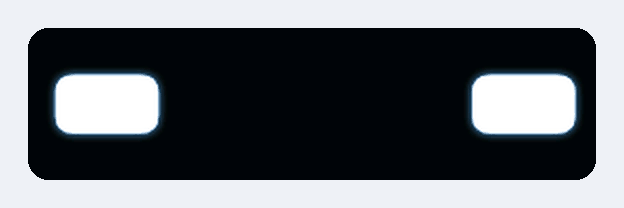
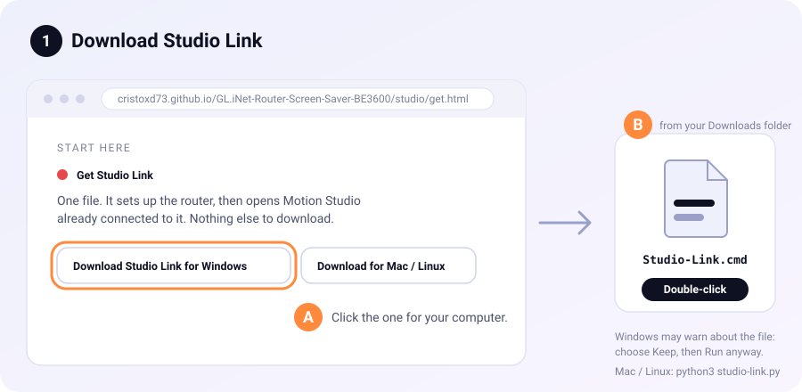
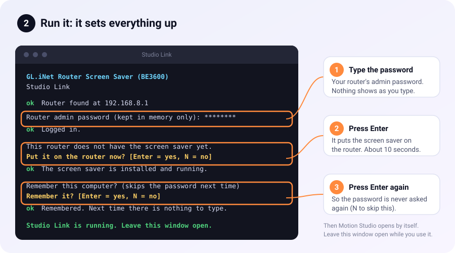
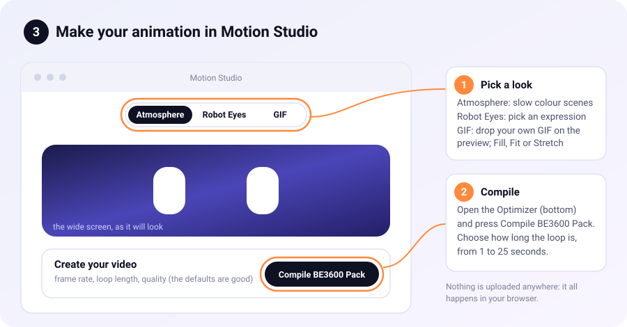
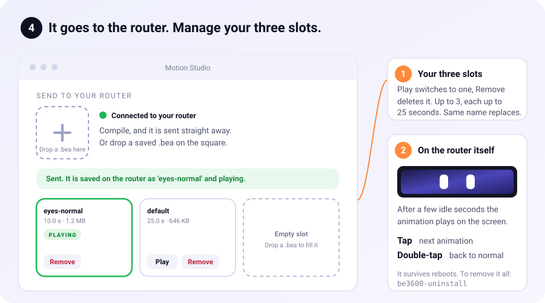
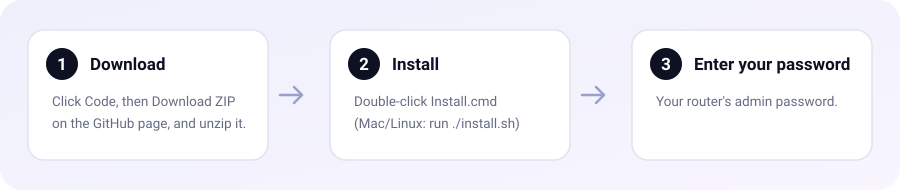

<div align="center">

# GL.iNet Router Screen Saver (BE3600)

**Give your GL.iNet Slate 7's little front screen an animated screen saver.**<br>
Robot eyes, colour fields, your own text, or anything you design.

[](https://github.com/CristoXD73/GL.iNet-Router-Screen-Saver-BE3600/actions/workflows/ci.yml)
-2ea44f)




<sub>The animation that comes with it, shown as the wide strip. It loops for 25 seconds.</sub>

</div>

---

After a few idle seconds, this plays an animation on your BE3600's front
screen. Tap it once to flip to your next saved animation; double-tap to bring
the normal GL.iNet screen back. One download sets it all up, and one command
removes it — nothing about the router's firmware changes.

## Get started (two steps)

Needs: a GL-BE3600 (Slate 7), a computer on the same network as it, and its
admin password.

<div align="center">

### 1. [Open Motion Studio](https://cristoxd73.github.io/GL.iNet-Router-Screen-Saver-BE3600/studio/)

</div>

Design an animation there (colour scenes, robot eyes, or your own GIF). The page
has a **Download Studio Link** button.

**2. Download Studio Link and double-click it** (Windows: the `.cmd` file; Mac /
Linux: `python3 studio-link.py`). It's a single file, and it does the rest:

* finds your router by itself,
* asks for the router's admin password **once** (*nothing shows while you type,
  that's normal*),
* **puts the screen saver on the router** if it isn't there yet (press Enter),
* offers to **remember this computer** (locked with a passphrase only you can open), so you never type the password again,
* and opens Motion Studio, already connected.

After that, **Compile** in Motion Studio sends your animation to the router
straight away, and the three slots on the page show what's on it. That's it: the
animation shows up on the screen after a few idle seconds and survives reboots.

### Step by step

<div align="center">









</div>

<details>
<summary><b>Prefer not to use the website? Install from the ZIP</b></summary>

**Windows:** Click **Code → Download ZIP** above, unzip it, double-click
**`Install.cmd`**, and type your router's admin password when it asks.

**macOS / Linux:** `./install.sh`


</details>

<details>
<summary><b>Something went wrong, or you want to know what it does</b></summary>

* **Windows says the script is blocked.** Right-click the ZIP → *Properties* →
  tick *Unblock* → OK, then unzip again. Or click *More info, Run anyway*.
* **It can't find the router.** It tries the last address that worked, then
  your gateway, then `192.168.8.1`. Wrong router? It'll ask once and remember
  the answer, or give it directly: `Install.cmd -Router 192.168.x.x`.
* **The password** is your router's normal admin password, typed into `ssh`'s
  own prompt — these scripts never see or store it.
* **What it changes:** a few small files on the router, plus a background
  service. See [below](#turn-it-off-or-remove-it) to undo that.

More help: [`docs/TROUBLESHOOTING.md`](docs/TROUBLESHOOTING.md).
</details>

## Design one, and get it onto the router

<div align="center">

### [Open Motion Studio](https://cristoxd73.github.io/GL.iNet-Router-Screen-Saver-BE3600/studio/)


</div>

Motion Studio is a page in your browser: nothing to install, nothing uploaded.
Pick **Atmosphere** (six slow colour scenes), **Robot Eyes** (a library of expressions) or **GIF** (bring your own; the compiler crops or fits it to the strip), shape it, then open **Compiler and optimizer** (**Create your
video**) and click **Compile BE3600 Pack**. It asks how long the loop should
be (1-25 s).

With **Studio Link** running (step 2 above), Motion Studio connects to your router
by itself:

* **Compile** sends the animation to the router straight away, named after what
  you made (type your own name in the box if you like).
* The page shows **your router's three animation slots**: each filled slot has its
  name, length and size (the one playing is marked **PLAYING**) with **Play** and
  **Remove**; the rest say *Empty slot*.
* Already have a `.bea` file? **Drop it on the square with the plus** (or click the
  square to choose one). Each file is checked first, so a bad file gets a
  plain-English reason instead of breaking anything.

Windows may warn about the downloaded `.cmd` file (choose *Keep* / *Run anyway*);
it's plain text you can open in Notepad first. If you cloned this repo you can
double-click `Studio-Link.cmd` (macOS/Linux: `./studio-link.sh`) instead; same thing.
If Studio Link isn't running, or your browser blocks it, the old way still works:
save the file and drag it onto **`Set-Animation.cmd`** (or run `./set-animation.sh`).

**The router keeps up to 3**, so you can switch back later, and **each loops for
at most 25 s**. The same name replaces the old one. Manage them from a terminal:
`be3600-anim list` / `use NAME` / `remove NAME` (see
[all commands](#turn-it-off-or-remove-it)).
<details>
<summary><b>What is Studio Link, and is it safe?</b></summary>

A web page can't log in to your router by itself, so Studio Link is a tiny
helper that does it for the page, using the same check-then-SSH steps as
`Set-Animation`.

* It listens on **this computer only** (`127.0.0.1`); nothing else on your
  network can reach it.
* **Only your own Motion Studio tab can use it.** Each time Studio Link starts it makes a
  fresh secret token and opens Motion Studio with that token in the address; the page keeps
  it and sends it with every request. Other websites, other programs and other users on this
  computer don't have it, so they get nothing. (A page also has to come from Motion Studio's
  own site or `localhost`, and a sandboxed page, `Origin: null`, is always refused. Running a
  fork on another address? Set `STUDIO_LINK_ORIGINS`.)
* It only ever accepts a valid `.bea` animation (checked here and again on the
  router), and only while you have it running.
* **Your router password is typed into the Studio Link window**, never into
  the web page. It is held in that window's memory only, handed to `ssh` for the
  moment each call runs (so nothing else it starts, such as your browser, can
  inherit it), and never written to disk.
* **Remember this computer** (optional, asked once) keeps a private key on this
  computer and adds its public half to the router, so the password is never asked
  again. The key file is **locked with a long random passphrase**, and that passphrase
  is kept where only you can open it: Windows' per-account encryption (DPAPI), the macOS
  Keychain, or the Linux keyring. Copying the key file somewhere else gets nobody in.
  Anyone signed in as you on this computer can still reach the router, so undo it any
  time with `Studio-Link.cmd -Forget` (`python3 studio-link.py --forget`), which also
  removes it from the router. (No keychain available? It just doesn't offer to remember.)
* The single file also carries the screen saver's own files, so it can install
  them on your router. It only does that when you press Enter to agree.
* **Checking a download:** `studio/downloads/SHA256SUMS` lists the checksums, and the
  router program inside is built reproducibly from `native/be3600-player.c`
  (`sh native/build-reproducible.sh --check`). See [`SECURITY.md`](SECURITY.md).
* It refuses a router address that isn't a plain address, and asks before sending a
  password to an address outside a home or office network.
* Your browser may ask to allow "devices on your local network". Choose Allow.
  Some browsers may block it entirely; then use `Set-Animation` as above.</details>
<details>
<summary><b>Smaller files, and making animations without the Studio</b></summary>

Motion Studio already saves the compact `BEA2` format (only what changes
between frames — usually 10x smaller than storing every frame in full,
`BEA1`). Got an old `BEA1` file? `tools/bea2.py` converts either way, losslessly:

```sh
python3 tools/bea2.py encode old-file.bea smaller.bea
```

`tools/make-preview-gif.py file.bea preview.gif` renders a GIF (`pip install
pillow`). Format details: [`docs/BEA-FORMAT.md`](docs/BEA-FORMAT.md).
`tools/make-sample-bea.py` makes a couple of test patterns.
</details>

## Turn it off, or remove it

On the router, in a terminal (see [how to open one](docs/TROUBLESHOOTING.md#how-to-open-a-terminal-on-the-router)):

```sh
be3600-anim off            # switch it off; everything stays installed
be3600-anim on             # switch it back on
be3600-uninstall           # remove it completely (keeps your animations)
be3600-uninstall --purge   # remove everything
```

Either way, the normal GL.iNet screen comes back exactly as it was.

<details>
<summary><b>All commands and settings</b></summary>

| Command | What it does |
|---------|--------------|
| `be3600-anim on` / `off` | Enable / disable, and restore the normal screen. |
| `be3600-anim status` | Is it on, who owns the screen, which animation. |
| `be3600-anim set FILE.bea [NAME]` | Check, save to the library, and play it. |
| `be3600-anim list` / `use NAME` / `remove NAME` | Manage the saved animations. |
| `be3600-anim preview [FILE.bea] [SECONDS]` | Try one without installing it. |
| `be3600-anim check` | Validate the active animation, show its length. |
| `be3600-anim doctor` | Full health check — run this first if anything's off. |

Settings live in `/etc/be3600-screen/config` (`be3600-anim on` to apply):

```sh
IDLE_SECONDS=10                 # seconds idle before the animation starts (0 = at once)
DOUBLE_TAP_WINDOW_SECONDS=0.4   # a second tap this close is a double-tap; else it switches animation
SWITCH_FADE_MS=250              # crossfade time when switching (native player only)
TOUCH_DEVICE=""                 # leave empty: found automatically
PLAYER_ENGINE="auto"            # "auto" = fast native player when installed; "lua" forces the fallback
```
</details>

## Good to know

* **Only tested on a GL-BE3600**, firmware 4.8.3. The installer and the
  screensaver both refuse to touch a display that doesn't match.
* **A tap waits ~0.4 s** to see if a second one follows — that's the
  double-tap window, not lag.
* **Firmware upgrades:** untested for real, but the files are on OpenWrt's
  "keep settings" list, and the screensaver re-checks the display after any
  version change before taking it over. Missing something? Rerun the installer.
* **Fast full-screen motion may tear a little** — this display has no way to
  avoid it ([why](docs/TEARING.md)); gentle motion looks best.
* Windows was tested on Windows 11; macOS/Linux only in a Linux container,
  **not on a real Mac**.

## For the curious

| | |
|---|---|
| [`docs/HOW-IT-WORKS.md`](docs/HOW-IT-WORKS.md) | What runs on the router and why |
| [`docs/BEA-FORMAT.md`](docs/BEA-FORMAT.md) | The animation file format (`BEA1`, `BEA2`) |
| [`docs/TEARING.md`](docs/TEARING.md) | What was measured about tear-free drawing |
| [`docs/TROUBLESHOOTING.md`](docs/TROUBLESHOOTING.md) | Fixes for common problems |

```
Install.cmd / install.sh          one-click installer
Set-Animation.cmd / set-animation.sh   drag-and-drop animation swap
Studio-Link.cmd / studio-link.sh       lets Motion Studio send animations to the router
studio/                            Motion Studio (the browser tool)
animations/                        the bundled animation
router/                            files that end up on the router
setup/                             install / uninstall scripts that run there
native/                            source of the fast player + build script
tools/                             Windows scripts, and animation helpers
tests/                             the test suite (sh tests/run.sh)
docs/                              the guides above
```

## License

MIT, see [LICENSE](LICENSE), including the bundled animation. Motion Studio
uses Three.js and Vanta.js (both MIT) — see
[`studio/OPEN_SOURCE.md`](studio/OPEN_SOURCE.md). Not affiliated with or
endorsed by GL Technologies. Use at your own risk: this takes over the
router's front display while the animation plays.
