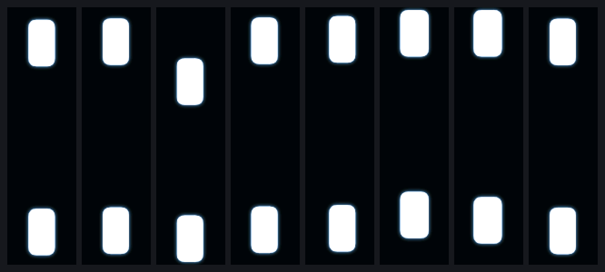

<div align="center">

# GL.iNet Router Screen Saver (BE3600)

**A custom animation screen saver for the small front display of the GL.iNet GL-BE3600 (Slate 7) travel router.**

[](https://github.com/CristoXD73/glinet-router-screensaver-be3600/actions/workflows/ci.yml)


<sub>Design preview of a browser studio for making animations. It is not part of this release yet.</sub>

</div>

---

Leave the router alone for a few seconds and an animation takes over the
screen. Touch it and the normal GL.iNet UI comes straight back. One command
turns it off, one script removes it, and swapping in your own animation is a
drag and drop.

<div align="center">

<br><sub>The bundled animation (25 seconds, looping): two eyes that look around.</sub>
</div>

## Highlights

| | |
|---|---|
| **One-click install** | Double-click `Install.cmd` (Windows) or run `./install.sh`. Type your router password and it goes. |
| **Finds your router** | Tries the last address that worked, then your default gateway, then `192.168.8.1`. |
| **Animation included** | The default animation is bundled, so there is nothing else to download. |
| **Drag and drop** | Drop a `.bea` file on `Set-Animation.cmd` to swap your animation. It is checked before it is sent. |
| **Touch to wake** | The touchscreen is auto-detected. Touch it and the stock UI returns instantly. |
| **Survives reboots** | It is a `procd` service, and it stays until you turn it off or uninstall it. |
| **Self-checking** | `be3600-anim doctor` tells you in plain words whether everything is healthy. |
| **Tested** | A test suite and CI cover the animation format, the player, touch detection and the scripts. |

## Install: one click

**Windows**

1. Click **Code, Download ZIP** on this page and unzip it.
2. Double-click **`Install.cmd`**.
3. Type your router's admin password when asked. That's it.

**macOS / Linux**

```sh
./install.sh
```

It finds your router by itself: it tries the address that worked last time,
then this computer's default gateway, then GL.iNet's factory address
(`192.168.8.1`). If none of those is your BE3600 (for example, it sits behind
another router), it asks for the address once and remembers it. To use a
specific address: `Install.cmd -Router 192.168.x.x` or `./install.sh 192.168.x.x`.

The animation is bundled, so there is nothing else to download. If your router
already has an animation, the installer keeps it.

> The password is the same one you use on the router's admin page. It is typed
> into `ssh`'s own prompt; these scripts never see or store it. On the first
> connection the router's SSH key is trusted automatically (`accept-new`).
>
> Windows may warn about a script downloaded from the internet. Right-click the
> ZIP, choose Properties, and tick **Unblock** before unzipping, or choose
> "More info, Run anyway" on the warning.

## Change the animation: drag and drop

**Windows:** drag a `.bea` file onto **`Set-Animation.cmd`**. Or double-click it
and drag the file into the window that opens.

**macOS / Linux:** run `./set-animation.sh`, then drag the file into the window.

The tool checks the file first and tells you in plain words what is wrong if it
is not a valid animation, then sends it to the router and switches over. You
can drop several files in a row.

A `.bea` is a very simple format: see [`docs/BEA-FORMAT.md`](docs/BEA-FORMAT.md).
To generate test animations, [`tools/make-sample-bea.py`](tools/make-sample-bea.py)
makes a red/green/blue/white colour test and a scrolling rainbow.

## Everyday use

Over SSH on the router (`ssh root@<router-address>`):

| Command | What it does |
|---------|--------------|
| `be3600-anim on` | Enable at boot and start now. |
| `be3600-anim off` | Stop, restore the stock screen, and don't start at boot. |
| `be3600-anim status` | Show whether it is enabled/running, who owns the display, and the active animation. |
| `be3600-anim set FILE.bea` | Check `FILE.bea` and make it the active animation. |
| `be3600-anim check` | Validate the active animation and print its loop length. |
| `be3600-anim doctor` | Full health check: display, touchscreen, animation, service, single display owner, free space. |

The screen saver survives reboots. Touching the screen only dismisses it for a
moment; it comes back when the screen has been idle again. `be3600-anim off` is
the one thing that stops it.

### Settings

`/etc/be3600-screen/config`:

```sh
ANIMATION="/etc/be3600-screen/active.bea"
IDLE_SECONDS=10      # seconds without a touch before the animation starts (0 = at once)
TOUCH_DEVICE=""      # leave empty to auto-detect the touchscreen
```

Run `be3600-anim on` after editing to apply.

## Remove

Over SSH on the router:

```sh
be3600-uninstall            # remove the screen saver, keep your animation + config
be3600-uninstall --purge    # remove everything, including /etc/be3600-screen
```

It stops and disables the service, deletes the installed files, removes the
`sysupgrade.conf` entries, and makes sure the stock GL.iNet screen is running
again. The difference from `be3600-anim off`: `off` is a switch (everything
stays installed, easy to turn back on); `be3600-uninstall` deletes it.

## How it works

The short version: `gl_screen` (GL.iNet's UI) and this project's player must
never draw to `/dev/fb0` at the same time, so a small supervisor script hands
the display back and forth between them, using the touchscreen to decide when.
The full story, including a subtle input-device bug worth knowing about, is in
[`docs/HOW-IT-WORKS.md`](docs/HOW-IT-WORKS.md). Fixes for common problems are
in [`docs/TROUBLESHOOTING.md`](docs/TROUBLESHOOTING.md).

## Limitations

* **Only tested on a GL-BE3600** (display `fb_st7789p3`, 76x284, touch
  controller Hynitron CST816X) with firmware 4.8.3. The installer refuses to
  install on a device without that display unless you set `FORCE=1` on the
  router, and it will ask for a different address if you point it at the wrong
  device. The supervisor also refuses to take over a display whose layout does
  not match.
* The Windows scripts were tested on Windows 11; the macOS/Linux scripts were
  tested in a Linux container, **not on a real Mac**.
* **While the animation is showing, GL.iNet's screen UI is stopped.** Touch the
  screen to get it back.
* **Firmware upgrades are untested.** The installer lists the project's files
  in `/etc/sysupgrade.conf` so a "keep settings" upgrade should preserve them,
  but this has not been verified. Just run the installer again if anything is
  missing afterwards.
* The player writes frames directly to `/dev/fb0` with no double buffering, so
  fast, full-screen motion may show tearing.
* Uses only what ships in the firmware (`sh`, `lua`, `procd`); nothing to
  compile.

## What's in the folder

```
Install.cmd        Windows: double-click to install
Set-Animation.cmd  Windows: drag a .bea onto it to change the animation
install.sh         macOS/Linux installer
set-animation.sh   macOS/Linux drag-and-drop tool
animations/        the bundled animation (gzip-compressed)
router/            files that end up on the router (same paths as on the device)
setup/             scripts that run on the router during install / uninstall
tools/             the Windows PowerShell behind the .cmd files, make-sample-bea.py
tests/             test suite (run with: sh tests/run.sh)
docs/              BEA-FORMAT, HOW-IT-WORKS, TROUBLESHOOTING
```

## License

MIT, see [LICENSE](LICENSE), including the bundled animation. Not affiliated
with or endorsed by GL Technologies. Use at your own risk; this replaces the
display owner on your router.
